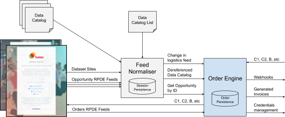
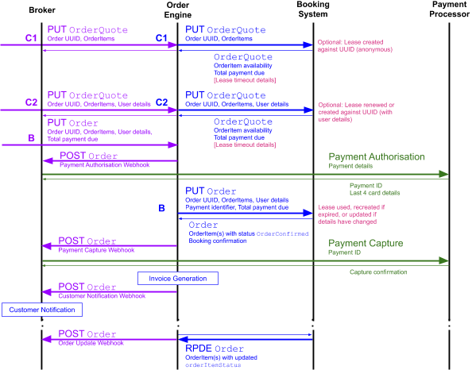

<h1 class="c17" id="h.a51yq6t37gs6">Order Engine Design</h1>
This document contains a high-level design of an Order Engine, which would ease the integration of Brokers with Booking Systems.

It has a dependency of a yet-to-be-built Feed Normaliser, and sits within an overall architecture of components outlined below. The Architecture and and Feed Normaliser high-level design are included here for context.

This work is licensed under a <a class="c7" href="https://www.google.com/url?q=http://creativecommons.org/licenses/by/4.0/&amp;sa=D&amp;ust=1580153836805000">Creative Commons Attribution 4.0 International License</a>.
<h1 class="c17" id="h.9jqaud5oq8b5">Architecture</h1>
The services are separated by their function, and after a thorough analysis there is little useful overlap between the three feed consumption services - such that a clean separation of concerns exists, as shown in the diagram below.
<h2 class="c13" id="h.97betwfduslz"></h2><h1 class="c17" id="h.85r07lh74irl">Production</h1><h2 class="c13" id="h.ltfakqqn0y1z">Order Engine</h2>

<h3 class="c10" id="h.pik1h1en4f5h">Scope</h3>
Goals:
<ul class="c8 lst-kix_8xfnpm7oac6i-0 start"><li class="c1 c2">Microservice</li><li class="c1 c2">Easy webhook configuration</li><li class="c1 c2">Orchestrate Broker side Order logic, via hooks for Broker events in Booking flow</li><li class="c1 c2">Handles rollbacks</li><li class="c1 c2">Order persistence</li><li class="c1 c2">Order feed processing and notifications</li><li class="c1 c2">Passes through C1, C2, B</li><li class="c1 c2">Provides webhooks for Payment Capture, Payment Auth, Payment Refund and Order updates (Customer notice, Opportunity attendance updates, and cancellations)</li><li class="c1 c2">Uses Feed Normaliser for Change of Logistics notifications only</li><li class="c1 c2">Persists client credentials and authentication tokens for each Seller, granted by the Booking System</li><li class="c1 c2">Trigger and handle the associated OAuth flows</li><li class="c1 c2">Generate basic HTML invoices</li></ul>

Non-goals:
<ul class="c8 lst-kix_8xfnpm7oac6i-0"><li class="c1 c2">Opportunity persistence</li><li class="c1 c2">Aggregating opportunity data (though the Feed Normaliser can feed an Search service directly)</li><li class="c1 c2">Use by Integration Tests</li></ul><h3 class="c10" id="h.xqnf8tpos9az">Interfaces</h3>
Configured with:
<ul class="c8 lst-kix_9t6symsqh4pd-0 start"><li class="c1 c2">Feed Normaliser URL</li><li class="c1 c2">OAuth Client credentials for each Booking System</li></ul>

Input:
<ul class="c8 lst-kix_b2p0ixgnf4uv-0 start"><li class="c1 c2">Dereferenced Data Catalogue from Feed Normaliser</li><li class="c1 c2">Change of Logistics RPDE Feeds</li><li class="c1 c2">Open Booking API endpoints</li><li class="c1 c2">Get Opportunity by ID endpoint</li></ul>

Output
<ul class="c8 lst-kix_7m1ve6jts2um-0 start"><li class="c1 c2">C1, C2 and B passthrough</li><li class="c1 c2">Payment Auth Webhook</li><li class="c1 c2">Payment Auth Cancellation Webhook</li><li class="c1 c2">Payment Capture Webhook</li><li class="c1 c2">Payment Refund Webhook, and Cancellation Processed Webhook</li><li class="c1 c2">Order Update Webhook</li><li class="c1 c2">Change of Logistics Webhook</li><li class="c1 c2">Customer Notification Webhook</li><li class="c1 c2">Customer Notice Webhook</li><li class="c1 c2">Opportunity attendance updates Webhook</li><li class="c1 c2">Credentials management admin page</li></ul>

<h3 class="c10" id="h.sy0krlvxkbj2">Logistics Hash</h3>
A Change of Logistics feed endpoint should be available from the Feed Normaliser, which only includes opportunities where the contents of their logistics properties (e.g. due to change of address, startDate, etc) have changed. This can be achieved by computing a simple hash of the logistics properties, and comparing the old hash to the new hash on each RPDE item update. Where the hashes are different, a field is set against the item that includes it in the change of logistics feed at the time such a hash difference was noticed (this would likely be a &ldquo;logistics_updated&rdquo; field in Opportunity table, to ensure the change of logistics RPDE feed is ordered by logistics updates only. Null values of &ldquo;logistics_updated&rdquo; are simply not included in the feed). The logic to compute this hash should be included in the Harvester Utilities Library.
<h3 class="c10" id="h.44m0kmsbwe8u">Functional Specification</h3>
A microservice that is configured through environment variables (including webhook URLs).

The microservice acts as pass-through for C1, C2, and B calls, using the Get Opportunity by ID endpoint of the Feed Normaliser to check the validity of the opportunities requested, and that their logistics match those provided.

The microservice persists each Order that is created through B, along with the <a class="c7" href="https://www.google.com/url?q=https://www.openactive.io/open-booking-api/EditorsDraft/%23booking-flow-rollback&amp;sa=D&amp;ust=1580153836811000">orderCreationStatus</a>&nbsp;defined in the Open Booking API specification. This allows it to effectively execute the rollback procedure. It also computes a <a class="c7" href="#h.sy0krlvxkbj2">logistics hash</a>&nbsp;of each referenced Opportunity before storing it. The microservice relies on a Postgres database, to allow it to be easily run within a number of hosting environments.

The microservice processes the Change of Logistics feed from the Feed Normaliser, for each opportunity retrieved it computes the <a class="c7" href="#h.sy0krlvxkbj2">logistics hash</a>&nbsp;against all stored Orders that reference the opportunity. It then runs a query to return all Orders that have a matching opportunity ID with a differing <a class="c7" href="#h.sy0krlvxkbj2">logistics hash</a>, and triggers a Change of Logistics Webhook call for each, which highlights the properties that have changed - including the old and new content for each. 

The microservice calls the Payment Auth and Payment Capture webhooks as part of processing B.

The microservice also processes the Orders feed, and triggers a webhook for any Order updates: Customer notice, Cancellation and Opportunity attendance updates. In the case of cancellation, it triggers a Payment Refund webhook.

The microservice will also handle the broker-side steps required to <a class="c7" href="https://www.google.com/url?q=https://www.openactive.io/open-booking-api/EditorsDraft/%23step-by-step-process-description&amp;sa=D&amp;ust=1580153836813000">process B</a>, including retrying the Customer Notification webhook. It will also handle the <a class="c7" href="https://www.google.com/url?q=https://www.openactive.io/open-booking-api/EditorsDraft/%23booking-flow-rollback&amp;sa=D&amp;ust=1580153836813000">booking flow rollback</a>, by calling the Payment Auth Cancellation, issuing an Order Deletion (DELETE) request (it does not attempt to retry payment).

The service generates basic HTML invoices associated with each Order (in accordance with the specification described <a class="c7" href="https://www.google.com/url?q=https://www.gov.uk/guidance/vat-guide-notice-700%23information-required-on-a-vat-invoice&amp;sa=D&amp;ust=1580153836814000">here</a>), and makes them available at a URL which is included in the Customer Notification, Order Update, and Cancellation Processed Webhooks.

The service handles persisting the OAuth Client Credentials for each Booking System, and OAuth Access Tokens for each Seller within each Booking System. It also handles triggering the OAuth flows described <a class="c7" href="https://www.google.com/url?q=https://tutorials.openactive.io/open-booking-sdk/quick-start-guide/storebookingengine/day-8-authentication&amp;sa=D&amp;ust=1580153836814000">here</a>.

A simple HTML page is available that allows the Broker to manage their client credentials for each booking system.
<h3 class="c10" id="h.44ckkojzthw1">Separation of Concerns</h3>
It is possible to split this microservice into an Orders Engine library and wrapping microservice, to provide more flexibility in implementation options. However given its dependency on a database for persistence and booking system authentication credentials, this document suggests that abstracting a library from the microservice is an opportunity for future iterations rather than for the initial build.
<h3 class="c10" id="h.ba9xjkuc6kaq">Suggested Task Breakdown</h3><ul class="c8 lst-kix_eb300q65awmz-0 start"><li class="c1 c2">Create simple pass-through microservice for C1, C2 and B that stores Orders from B in a Postgres database. The jsonb data type should be used to allow the Orders to be queried.</li><li class="c1 c2">Improve the B call to use the Get Opportunity by ID endpoint of the Feed Normaliser to check the validity of the opportunities requested, and that their logistics match those provided, and compute a logistics hash to store alongside each opportunity (in a new custom property) within the jsonb column. It should call the Customer Notification webhook when complete.</li><li class="c1 c2">Add RPDE polling for the Orders feed from the booking system, and the Change of Logistics feed from the feed normaliser, using a similarly robust approach to that taken within the Feed Normaliser </li><li class="c1 c2">Implement Change of Logistics logic in response to new Change of Logistics feed items, as specified, including Change of Logistics webhook.</li><li class="c1 c2">Implement webhooks for the B happy path: Payment Auth, Payment Capture and Customer Notification</li><li class="c1 c2">Implement cancellation logic in response to Order feed update: Payment Refund webhook followed by Cancellation Processed Webhook.</li><li class="c1 c2">Implement other webhooks in response to Order feed update: Customer Notice Webhook, Opportunity attendance updates Webhook and generic Order Update Webhook - with the webhook triggered depending on the contents of the Order that has changed compared with the stored version. </li><li class="c1 c2">Implement booking flow rollback as specified.</li><li class="c1 c2">Generate HTML invoices as specified.</li><li class="c1 c2">Persist a table of booking systems (identified by their dataset sites), for each they should have OAuth Client Credentials and OAuth Access Tokens for each Seller within them. The pass-through call to C1, C2 and B should pick up the correct tokens from this table and use them to make the call to the correct booking system.</li><li class="c1 c2">Create a simple HTML page that lists the booking system&rsquo;s configured, the client credentials for each booking system, and how many Seller Access Tokens exist for that booking system. It allows client credentials for Booking Systems to be added to the database - the booking systems themselves are auto-populated to the page directly from the Dereferenced Single Data Catalog, but entries in the booking system table are made when Client Credentials are set against the booking system.</li><li class="c1 c2">Create endpoint that triggers Seller OAuth flow</li></ul>

<h2 class="c13" id="h.8zzj17y7qt8j">Feed Normaliser</h2>
Consumes multiple feeds from each publisher&rsquo;s dataset and combines them into one

<h3 class="c10" id="h.lap0j6ihacb3">Scope</h3>
Goals:
<ul class="c8 lst-kix_pxeilrtsah8j-0 start"><li class="c1 c2">Data-driven configuration, so it will work &ldquo;out of the box&rdquo;</li><li class="c1 c2">Read multiple dataset sites automatically from a data catalog</li><li class="c1 c2">Combine all feeds into a normalised feed</li><li class="c1 c2">Provide a change of logistics feed</li><li class="c1 c2">Production-ready</li></ul>

Non-goals:
<ul class="c8 lst-kix_w7loyzhp41nm-0 start"><li class="c1 c2">Support for in-memory or test suite</li><li class="c1 c2">Support for anything related to the Open Booking API</li></ul><h3 class="c10" id="h.v7ko0wrwatac">Interfaces</h3>
Configured with:
<ul class="c8 lst-kix_6hqt92egmr6v-0 start"><li class="c1 c2">URL of JSON file containing data catalogue URLs</li></ul>

Input:
<ul class="c8 lst-kix_1x8foka706k4-0 start"><li class="c1 c2">Data Catalogues (which contain Dataset Site URLs)</li><li class="c1 c2">Dataset Sites</li><li class="c1 c2">Opportunity RPDE Feeds</li></ul>

Output
<ul class="c8 lst-kix_wucoljsyulpo-0 start"><li class="c1 c2">Single normalised feeds for Sessions, Facilities, Courses, etc</li><li class="c1 c2">Single normalised feed for only Sessions, Facilities, Courses, etc that have had a Change in Logistics&nbsp;since the service started</li><li class="c1 c2">Dereferenced single data catalog endpoint, that includes Dataset Site content for each of the feeds contained in the single normalised feed, and polling statistics/status for each</li><li class="c1 c2">Get Opportunity by ID endpoint for all <a class="c7" href="https://www.google.com/url?q=https://www.openactive.io/open-booking-api/EditorsDraft/%23definition-of-a-bookable-opportunity-and-offer-pair&amp;sa=D&amp;ust=1580153836819000">&ldquo;Bookable&rdquo; opportunity types</a></li></ul><h3 class="c10" id="h.rzzucqo3rkhi">Functional Specification</h3>
The service should read from the Data Catalogs specified by the <a class="c7" href="https://www.google.com/url?q=https://github.com/openactive/dataset-api-discovery/issues/8&amp;sa=D&amp;ust=1580153836819000">Data Catalog list</a>&nbsp;configured in an environment variable, and spider the referenced Dataset Sites, automatically registering feeds to consume. The list of Dataset Sites being consumed should be available via the Dereferenced single data catalog endpoint, with polling statistics/status for each.

This service normalises ingested feeds from these into a standard data model (ScheduledSession, SessionSeries, EventSeries, etc), contained within tables &ldquo;Opportunity&rdquo;, &ldquo;ParentOpportunity&rdquo;, and &ldquo;GrandparentOpportunity&rdquo; (which include the item JSON), and provide a single feed as output that is created by joining these three tables. Note that when a &ldquo;ParentOpportunity&rdquo; entry is updated, all &ldquo;Opportunity&rdquo; entries must be updated to ensure they are included in the normalised feed.

The feeds within each dataset site should be automatically recognised - using the &ldquo;parent&rdquo; attribute of <a class="c7" href="https://www.google.com/url?q=https://github.com/openactive/data-models/blob/master/versions/2.x/meta.json%23L9&amp;sa=D&amp;ust=1580153836820000">meta.json</a>&nbsp;to automatically infer &ldquo;Opportunity&rdquo; and &ldquo;OpportunityParent&rdquo;.

There is much overlap of the logic used to normalise feeds in-memory within the Feed Listener, and such logic should be moved into the Harvester Utilities Library to be shared between both codebases.

Given this service is designed for production, the RPDE polling mechanism needs to be robust e.g. using <a class="c7" href="https://www.google.com/url?q=https://www.npmjs.com/package/async-polling&amp;sa=D&amp;ust=1580153836821000">https://www.npmjs.com/package/async-polling</a>. Additionally it needs to be able to recover from a service outage, and hence the &lsquo;next&rsquo; URL for each feed must be persisted to allow for such recovery.

There should be a configuration option to not retain or propagate events in the past (i.e they don&rsquo;t get stored, and are filtered out at the point of ingestion), to minimise the size of the persistence required.

For each item, optionally (via configuration) run <a class="c7" href="https://www.google.com/url?q=https://github.com/openactive/data-model-validator/&amp;sa=D&amp;ust=1580153836822000">data-model-validator</a>&nbsp;validation and store results - this validation is carried out on the composited opportunity rather than on individual components. Results are included in the normalised feed as &ldquo;errors&rdquo; alongside the RPDE &ldquo;data&rdquo; property. 

A Change of Logistics feed endpoint is also available, which only includes opportunities where the contents of their logistics properties (e.g. due to change of address, startDate, etc) have changed. This can be achieved by computing a simple hash of the logistics properties, and comparing the old hash to the new hash on each RPDE item update. Where the hashes are different, a field is set against the item that includes it in the change of logistics feed at the time such a hash difference was noticed (this would likely be a &ldquo;logistics_updated&rdquo; field in Opportunity table, to ensure the change of logistics RPDE feed is ordered by logistics updates only. Null values of &ldquo;logistics_updated&rdquo; are simply not included in the feed). The logic to compute this hash should be included in the Harvester Utilities Library.

There is a mechanism, via a simple API endpoint, to reset all feeds within a specific dataset - causing its normalised content to be purged from the database, and for the feeds within the dataset to be synchronised again.

The Get Opportunity ID endpoint that returns the full composited JSON-LD for any of the <a class="c7" href="https://www.google.com/url?q=https://www.openactive.io/open-booking-api/EditorsDraft/%23definition-of-a-bookable-opportunity-and-offer-pair&amp;sa=D&amp;ust=1580153836823000">&ldquo;Bookable&rdquo; opportunity types</a>, including their embedded parents, as per the diagram below:

An API endpoint should be available that includes a dereferenced single data catalog, which contains Dataset Site content for each of the feeds contained in the single normalised feed, and polling statistics/status for each too. This can be achieved by augmenting the DataDownload objects in the distribution array within the Dataset&nbsp;with custom namespaced properties as follows:
<ul class="c8 lst-kix_gfleg554yf8e-0 start"><li class="c1 c2">Number of pages processed successfully: &ldquo;feedstatus:pagesProcessedSuccessfully&rdquo;</li><li class="c1 c2">Number of feed read errors encountered: &ldquo;feedstatus:pagesProcessedWithErrors&rdquo;</li><li class="c1 c2">Last processed page timestamp: &ldquo;feedstatus:lastPageReceivedDate&rdquo;,</li><li class="c1 c2">Number of updates received successfully: &ldquo;feedstatus:itemsProcessedSuccessfully&rdquo;</li><li class="c1 c2">Number of validator errors for these updates: &ldquo;feedstatus:itemsProcessedWithErrors&rdquo;</li></ul><h3 class="c10" id="h.bkutb3tlyuh3">Suggested Task Breakdown</h3><ul class="c8 lst-kix_wu6uhp5dqyen-0 start"><li class="c1 c2">Using Feed Listener as inspiration, create a Postgres-based version of the single normalised feed, using a single dataset site in order to receive URL configuration of feeds.</li><li class="c1 c2">Extend the implementation to work with multiple Dataset Sites, spidering data catalogs by ingesting a <a class="c7" href="https://www.google.com/url?q=https://github.com/openactive/dataset-api-discovery/issues/8&amp;sa=D&amp;ust=1580153836826000">Data Catalog List</a>&nbsp;as specified by an environment variable, and updating this hourly.</li><li class="c1 c2">Implement dereferenced single data catalog endpoint, including polling statistics/status for each feed as well as the original Dataset Site JSON-LD content.</li><li class="c1 c2">Implement reliable RPDE polling mechanism, including rate limiting (using a global rate limit) and exponential backoff (with a limit) in the case of error. RPDE page being ingested should be persisted to ensure the service is robust resume after an outage.</li><li class="c1 c2">Implement configurable feature to prevent events in the past from being ingested and stored.</li><li class="c1 c2">Implement Get Opportunity by ID endpoint</li><li class="c1 c2">Run <a class="c7" href="https://www.google.com/url?q=https://github.com/openactive/data-model-validator/&amp;sa=D&amp;ust=1580153836828000">data-model-validator</a>&nbsp;against each composite opportunity: this validation is carried out on the composited opportunity rather than on components from individual feeds. This can be done at the point of writing to the &ldquo;Opportunity&rdquo; table, where a &ldquo;ParentOpportunity&rdquo; exists.</li><li class="c1 c2">Implement dataset reset mechanism</li><li class="c1 c2">Implement change of logistics notification feed</li></ul>
